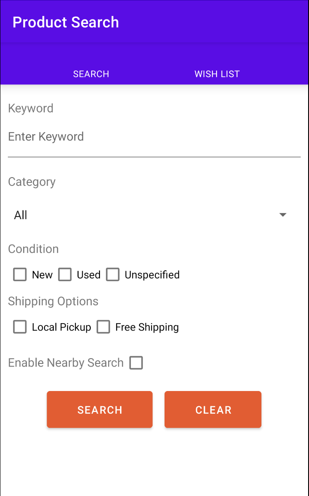
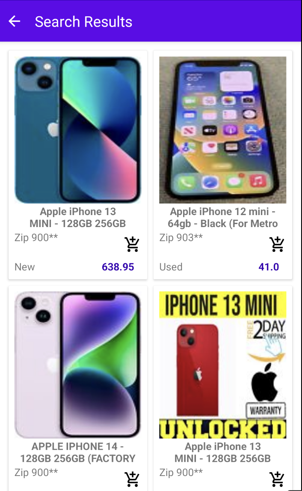
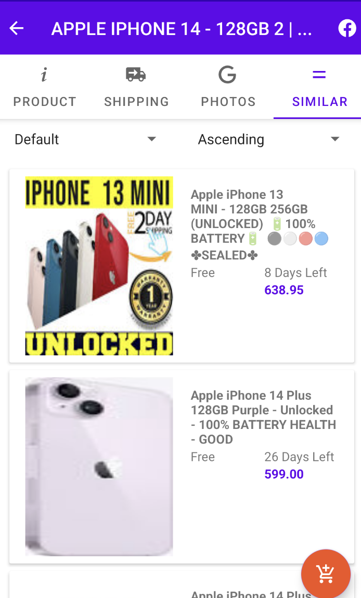

<!-- Improved compatibility of back to top link: See: https://github.com/othneildrew/Best-README-Template/pull/73 -->
<a name="readme-top"></a>
<!--
*** Thanks for checking out the Best-README-Template. If you have a suggestion
*** that would make this better, please fork the repo and create a pull request
*** or simply open an issue with the tag "enhancement".
*** Don't forget to give the project a star!
*** Thanks again! Now go create something AMAZING! :D
-->


<!-- PROJECT SHIELDS -->
<!--
*** I'm using markdown "reference style" links for readability.
*** Reference links are enclosed in brackets [ ] instead of parentheses ( ).
*** See the bottom of this document for the declaration of the reference variables
*** for contributors-url, forks-url, etc. This is an optional, concise syntax you may use.
*** https://www.markdownguide.org/basic-syntax/#reference-style-links
-->
[![Contributors][contributors-shield]][contributors-url]
[![Forks][forks-shield]][forks-url]
[![Stargazers][stars-shield]][stars-url]
[![Issues][issues-shield]][issues-url]
[![MIT License][license-shield]][license-url]
[![LinkedIn][linkedin-shield]][linkedin-url]


<!-- PROJECT LOGO -->
<br />
<div align="center">
  <a href="https://github.com/yingtu35/eBay_Search_app">
    
  </a>

<h3 align="center">eBay Search</h3>

  <p align="center">
    An Android mobile application for searching eBay products and creating wishlists
    <br />
    <a href="https://github.com/yingtu35/eBay_Search_app"><strong>Explore the docs »</strong></a>
    <br />
    <br />
    <a href="https://youtu.be/5e3OU2CHzfU" target="_blank">View Demo</a>
    ·
    <a href="https://github.com/yingtu35/eBay_Search_app/issues">Report Bug</a>
    ·
    <a href="https://github.com/yingtu35/eBay_Search_app/issues">Request Feature</a>
  </p>
</div>


<!-- TABLE OF CONTENTS -->
<details>
  <summary>Table of Contents</summary>
  <ol>
    <li>
      <a href="#about-the-project">About The Project</a>
      <ul>
        <li><a href="#built-with">Built With</a></li>
      </ul>
    </li>
    <li>
      <a href="#getting-started">Getting Started</a>
      <ul>
        <li><a href="#prerequisites">Prerequisites</a></li>
        <li><a href="#installation">Installation</a></li>
      </ul>
    </li>
    <!-- <li><a href="#usage">Usage</a></li> -->
    <li><a href="#roadmap">Roadmap</a></li>
    <li><a href="#contributing">Contributing</a></li>
    <li><a href="#license">License</a></li>
    <li><a href="#contact">Contact</a></li>
    <li><a href="#acknowledgments">Acknowledgments</a></li>
  </ol>
</details>


<!-- ABOUT THE PROJECT -->
## About The Project

<div align="center">
  
</div>

eBay_Search_app is a mobile application built on Android. Users can create customized search on eBay products, view product information and add products to wishlist if you find something interesting!

<p align="right">(<a href="#readme-top">back to top</a>)</p>


### Built With

* [![MongoDB][MongoDB.io]][MongoDB-url]
* [![Express][Express.dev]][Express-url]
* [![Android][Android]][Android-url]
* [![Node.js][Node.js.com]][Node.js-url]

<p align="right">(<a href="#readme-top">back to top</a>)</p>


<!-- GETTING STARTED -->
## Getting Started

Follow these steps to run the application in your host machine.

### Prerequisites

To run the application in your host machine, you need to have your **Anrdoid Studio** installed. Follow the instruction for proper installation.

  [Android][Android-url]

### Installation
* **Run in the host machine**
1. Clone the repo
   ```sh
   git clone https://github.com/yingtu35/eBay_Search_app.git
   ```
2. Open the project in Android Studio and run the app.


<p align="right">(<a href="#readme-top">back to top</a>)</p>


<!-- USAGE EXAMPLES -->
## Usage

Enjoy the short 2-min demo to see how eBay_Search_app works.

[Demo Link][demo-url]

<div align="center" display="flex" flex-direction="row" justify-content="center">


</div>

<!-- [](http://www.youtube.com/watch?v=MnJX33HtIVE "eBay_Search_app demo") -->

<p align="right">(<a href="#readme-top">back to top</a>)</p>


<!-- ROADMAP -->
## Roadmap

- [ ] Fix wishlist update when returning from product detail page

See the [open issues](https://github.com/yingtu35/eBay_Search_app/issues) for a full list of proposed features (and known issues).

<p align="right">(<a href="#readme-top">back to top</a>)</p>


<!-- CONTRIBUTING -->
## Contributing

Contributions are what make the open source community such an amazing place to learn, inspire, and create. Any contributions you make are **greatly appreciated**.

If you have a suggestion that would make this better, please fork the repo and create a pull request. You can also simply open an issue with the tag "enhancement".
Don't forget to give the project a star! Thanks again!

1. Fork the Project
2. Create your Feature Branch (`git checkout -b feature/AmazingFeature`)
3. Commit your Changes (`git commit -m 'Add some AmazingFeature'`)
4. Push to the Branch (`git push origin feature/AmazingFeature`)
5. Open a Pull Request

<p align="right">(<a href="#readme-top">back to top</a>)</p>


<!-- LICENSE -->
## License

Distributed under the MIT License. See `LICENSE.txt` for more information.

<p align="right">(<a href="#readme-top">back to top</a>)</p>


<!-- CONTACT -->
## Contact

Your Name - [@YingTu1685990](https://twitter.com/YingTu1685990) - yingtu35@gmail.com

Project Link: [https://github.com/yingtu35/eBay_Search_app](https://github.com/yingtu35/eBay_Search_app)

<p align="right">(<a href="#readme-top">back to top</a>)</p>


<!-- ACKNOWLEDGMENTS -->
## Acknowledgments

* [Android Studio Developers](https://developer.android.com/docs)
* [Stack Overflow](https://stackoverflow.com/)
* [ChatGPT](https://chat.openai.com/)
* [Chi Ting Hou](https://www.linkedin.com/in/chi-ting-hou-b974151b2/) (My Mentor)
<!-- * []()
* []() -->

<p align="right">(<a href="#readme-top">back to top</a>)</p>


<!-- MARKDOWN LINKS & IMAGES -->
<!-- https://www.markdownguide.org/basic-syntax/#reference-style-links -->
[contributors-shield]: https://img.shields.io/github/contributors/yingtu35/eBay_Search_app.svg?style=for-the-badge
[contributors-url]: https://github.com/yingtu35/eBay_Search_app/graphs/contributors
[forks-shield]: https://img.shields.io/github/forks/yingtu35/eBay_Search_app.svg?style=for-the-badge
[forks-url]: https://github.com/yingtu35/eBay_Search_app/network/members
[stars-shield]: https://img.shields.io/github/stars/yingtu35/eBay_Search_app.svg?style=for-the-badge
[stars-url]: https://github.com/yingtu35/eBay_Search_app/stargazers
[issues-shield]: https://img.shields.io/github/issues/yingtu35/eBay_Search_app.svg?style=for-the-badge
[issues-url]: https://github.com/yingtu35/eBay_Search_app/issues
[license-shield]: https://img.shields.io/github/license/yingtu35/eBay_Search_app.svg?style=for-the-badge
[license-url]: https://github.com/yingtu35/eBay_Search_app/blob/master/LICENSE.txt
[linkedin-shield]: https://img.shields.io/badge/-LinkedIn-black.svg?style=for-the-badge&logo=linkedin&colorB=0A66C2
[linkedin-url]: https://linkedin.com/in/yingtu
[product-screenshot]: images/screenshot.png
[Android]: https://img.shields.io/badge/Android-000000?style=for-the-badge&logo=Android&logoColor=3DDC84
[Android-url]: https://developer.android.com/studio
[Vue.js]: https://img.shields.io/badge/Vue.js-35495E?style=for-the-badge&logo=vuedotjs&logoColor=4FC08D
[Vue-url]: https://vuejs.org/
[MongoDB.io]: https://img.shields.io/badge/MongoDB-47A248?style=for-the-badge&logo=MongoDB&logoColor=white
[MongoDB-url]: https://www.mongodb.com/
[Express.dev]: https://img.shields.io/badge/Express-000000?style=for-the-badge&logo=Express&logoColor=white
[Express-url]: https://expressjs.com/
[MUI.com]: https://img.shields.io/badge/MUI-007FFF?style=for-the-badge&logo=MUI&logoColor=white
[MUI-url]: https://mui.com/
[Node.js.com]: https://img.shields.io/badge/Node.js-000000?style=for-the-badge&logo=Node.js&logoColor=339933
[Node.js-url]: https://nodejs.org/en
[Docker.com]: https://img.shields.io/badge/Docker-20232A?style=for-the-badge&logo=Docker&logoColor=2496ED
[Docker-url]: https://www.docker.com/
[nvm-url]: https://github.com/nvm-sh/nvm
[jest.com]: https://img.shields.io/badge/Jest-15C213?style=for-the-badge&logo=Jest&logoColor=C21325
[jest-url]: https://jestjs.io/
[demo-url]: https://youtu.be/5e3OU2CHzfU
